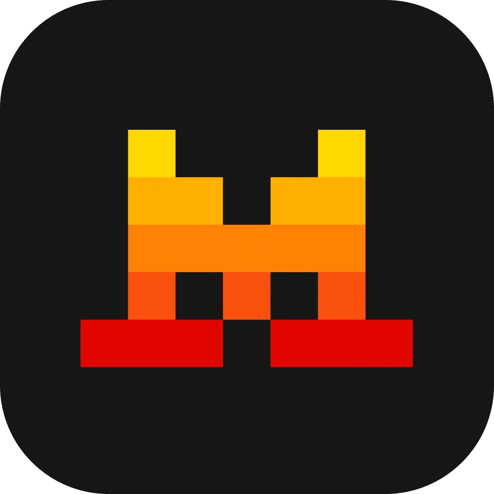

<div align="center">
  
  
  <p><strong>A fun platformer game featuring Le Chat, Mistral's mascot, with real-time keyboard input visualization!</strong></p>

   

  

</div>

# 🎮 Mistral Jump

## 🚀 About The Project

**Mistral Jump** is an interactive platformer game built with React and TypeScript that showcases real-time keyboard input visualization. Control Le Chat (Mistral's adorable mascot) as it jumps through procedurally generated platforms while your keyboard inputs are beautifully displayed on screen.

### ✨ Key Features

- 🎯 **Real-time Keyboard Visualization** - See your keystrokes come to life
- 🎮 **Smooth Platformer Gameplay** - Responsive controls with physics-based movement
- 🎨 **Mistral Brand Colors** - Beautiful gradient backgrounds using official Mistral colors
- 📱 **Mobile Responsive** - Optimized for both desktop and mobile devices
- 🎪 **Le Chat Character** - Play as Mistral's beloved mascot
- 🏗️ **Procedural Platform Generation** - Infinite gameplay with dynamically generated platforms
- ⚡ **High Performance** - Built with modern React hooks and optimized rendering

## 🎮 How to Play

### Controls

- **← Left Arrow** - Move Le Chat left
- **→ Right Arrow** - Move Le Chat right
- **Enter/Space** - Restart game (when game over)

### Gameplay

1. Use the arrow keys to move Le Chat left and right
2. Jump on platforms to climb higher and increase your score
3. Avoid falling off the bottom of the screen
4. Try to achieve the highest score possible!

### Scoring System

- Your score increases as you climb higher
- Each platform level gives you points
- Challenge yourself to beat your high score!

## 🛠️ Installation & Setup

### Prerequisites

- Node.js (v16 or higher)
- npm or yarn package manager

### Quick Start

1. **Clone the repository**

   ```bash
   git clone https://github.com/yourusername/mistral-jump.git
   cd mistral-jump
   ```

2. **Install dependencies**

   ```bash
   npm install
   ```

3. **Start the development server**

   ```bash
   npm run dev
   ```

4. **Open your browser**
   Navigate to `http://localhost:5173` to start playing!

### Available Scripts

| Script            | Description                              |
| ----------------- | ---------------------------------------- |
| `npm run dev`     | Start development server with hot reload |
| `npm run build`   | Build the project for production         |
| `npm run preview` | Preview the production build locally     |
| `npm run lint`    | Run ESLint to check code quality         |

## 🏗️ Project Structure

```
src/
├── components/          # React components
│   ├── GameCanvas.tsx   # Main game rendering component
│   ├── GameUI.tsx       # Game interface and overlays
│   └── LoadingScreen.tsx # Loading screen component
├── hooks/               # Custom React hooks
│   ├── useGameEngine.ts # Core game logic hook
│   └── useImageLoader.ts # Image loading hook
├── utils/               # Game utilities
│   ├── input.ts         # Keyboard input handling
│   ├── physics.ts       # Physics engine
│   ├── renderer.ts      # Canvas rendering
│   └── platformGenerator.ts # Platform generation
├── types/               # TypeScript type definitions
│   └── game.ts          # Game-related types
├── constants/           # Game configuration
│   └── game.ts          # Game constants and settings
└── assets/              # Static assets
    └── load.gif         # Loading animation
```

## 🎨 Technical Highlights

### Modern React Architecture

- **Custom Hooks** - Modular game logic with `useGameEngine` and `useImageLoader`
- **TypeScript** - Full type safety throughout the application
- **Performance Optimized** - Efficient rendering with canvas-to-image conversion

### Game Engine Features

- **Physics System** - Gravity, collision detection, and smooth movement
- **Input Handling** - Real-time keyboard input processing
- **Camera System** - Dynamic camera following the player
- **Platform Generation** - Procedural platform creation for infinite gameplay

### Visual Design

- **Mistral Branding** - Official Mistral color palette integration
- **Responsive Design** - Mobile-first approach with adaptive canvas sizing
- **Smooth Animations** - 60fps gameplay with requestAnimationFrame

## 🎯 Game Configuration

The game is highly configurable through `src/constants/game.ts`:

```typescript
export const GAME_CONFIG = {
  // Physics
  GRAVITY: 0.5,
  JUMP_FORCE: -15,
  MOVE_SPEED: 5,
  FRICTION: 0.8,

  // Visual - Official Mistral Colors
  MISTRAL_COLORS: {
    YELLOW: "#FFD800",
    ORANGE_LIGHT: "#FFAF00",
    ORANGE: "#FF8205",
    ORANGE_DARK: "#FA500F",
    RED: "#E10500",
  },

  // Platform settings
  PLATFORM_WIDTH: 120,
  PLATFORM_HEIGHT: 20,
  PLATFORM_SPACING: 120,

  // Player settings
  PLAYER_WIDTH: 90,
  PLAYER_HEIGHT: 90,
};
```

## 📄 License

This project is licensed under the MIT License - see the [LICENSE](LICENSE) file for details.

## 🙏 Acknowledgments

- **Mistral AI** - For the amazing Le Chat mascot and brand colors
- **React Team** - For the incredible React framework
- **Vite** - For the lightning-fast build tool
- **TypeScript** - For making JavaScript development a joy

---

<div align="center">
  <p>Made with ❤️ and lots of ☕</p>
  <p><strong>Happy Gaming! 🎮</strong></p>
</div>
